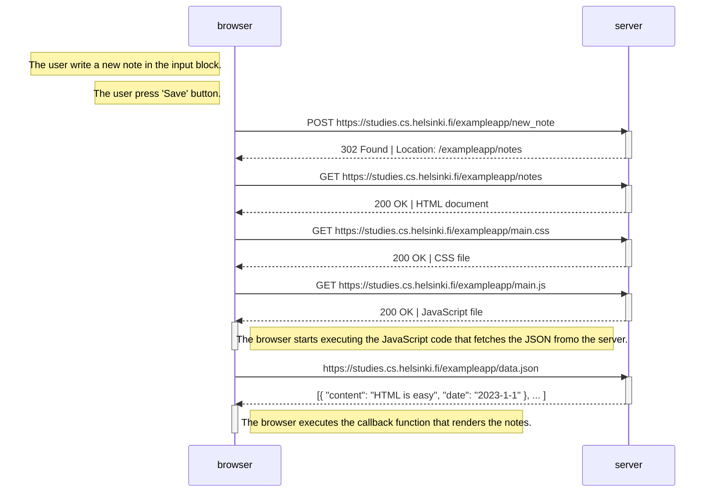

```mermaid
sequenceDiagram
  participant browser
  participant server

  note left of browser: The user write a new note in the input block.
  note left of browser: The user press 'Save' button.
  browser->>server: POST https://studies.cs.helsinki.fi/exampleapp/new_note
  activate server
  server-->>browser: 302 Found | Location: /exampleapp/notes
  deactivate server

  browser->>server: GET https://studies.cs.helsinki.fi/exampleapp/notes
  activate server
  server-->>browser: 200 OK | HTML document
  deactivate server

  browser->>server: GET https://studies.cs.helsinki.fi/exampleapp/main.css
  activate server
  server-->>browser: 200 OK | CSS file
  deactivate server

  browser->>server: GET https://studies.cs.helsinki.fi/exampleapp/main.js
  activate server
  server-->>browser: 200 OK | JavaScript file
  deactivate server
  activate browser

  note right of browser: The browser starts executing the JavaScript code that fetches the JSON fromo the server.

  deactivate browser
  browser->>server: https://studies.cs.helsinki.fi/exampleapp/data.json
  activate server
  server-->>browser: [{ "content": "HTML is easy", "date": "2023-1-1" }, ... ]
  deactivate server
  activate browser

  note right of browser: The browser executes the callback function that renders the notes.

  deactivate browser
```
